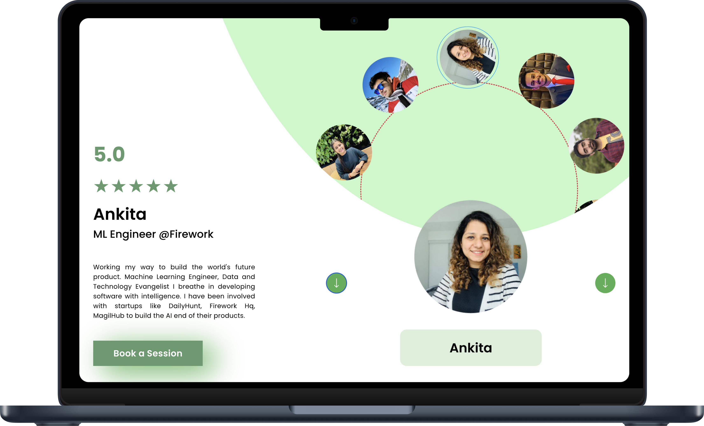

  
# Mentro-Assignment
  
# [DEMO LINK](https://circular-image-slider-mentro-assign.netlify.app/)
  
---

## This repo is created for the Frontend Intern role at Mentro.

I was shortlisted for the next stage of the interview process after my Resume was reviewed by Mentro

  
  
https://user-images.githubusercontent.com/89961974/224196809-1eeed943-5ef0-4f90-9f0f-b202e65e78d9.mov
  
---

<table>
  <tr>
    <td></td>
    <td></td>
  </tr>
</table>

---

### Frontend :

 

<h3 align="center"> DON'T FORGET TO ⭐ THIS REPOSITORY !!
</h3>

### You can follow me [here](https://github.com/Spyware007) ❤
